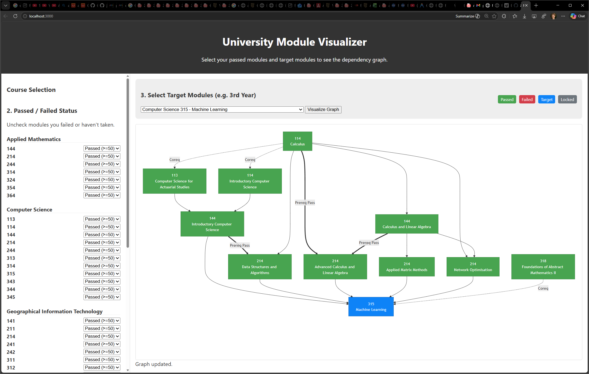
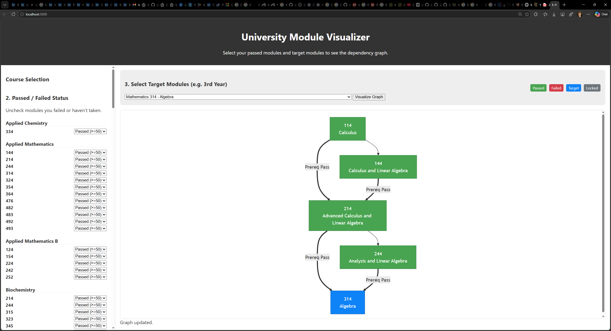

# University Module Visualizer





| [Stellenbosch_University_Yearbooks](https://www.su.ac.za/en/about/governance/registrar/yearbooks) |
| ------------------------------------------------------------------------------------------------- |

## 3. Summary of undergraduate modules and their requirements

### 3.1 Prerequisite pass, prerequisite and corequisite modules

For most undergraduate modules there are admission requirements given in terms of prerequisite pass, prerequisite and corequisite modules. These terms are explained below:

#### Prerequisite pass module

- A prerequisite pass module is a module that you must pass before you can take the module(s) for which it is a prerequisite pass module.

#### Prerequisite module

- A prerequisite module is a module in which you must obtain a **final mark of at least 40**, before you can take the module for which it is a prerequisite module.

- If you have once complied with a prerequisite rule, your compliance will remain valid for the period given in the applicable assessment rules, even if you repeat the prerequisite module and do not meet the minimum level when repeating the module.

- **Take note**: You must pass all the modules you took as prerequisites in the programme before the relevant degree, certificate or diploma can be awarded to you.

#### Corequisite module

- A corequisite module is a module that you must register for in an earlier semester than the module for which it is a corequisite, or in the same semester.

- Take note: You must pass all the modules you took as corequisites in the programme before the relevant degree, certificate or diploma can be awarded to you.

**Before** choosing and registering for any module, you must make sure that you meet the applicable
corequisite, prerequisite and prerequisite pass requirements provided in the tables below. There may also be
no class or assessment timetable clashes.

---

### Getting Started

#### Installation

```bash
npm install
```

#### Running the Server

```bash
node server.js
```

The application will start on `http://localhost:3000`
